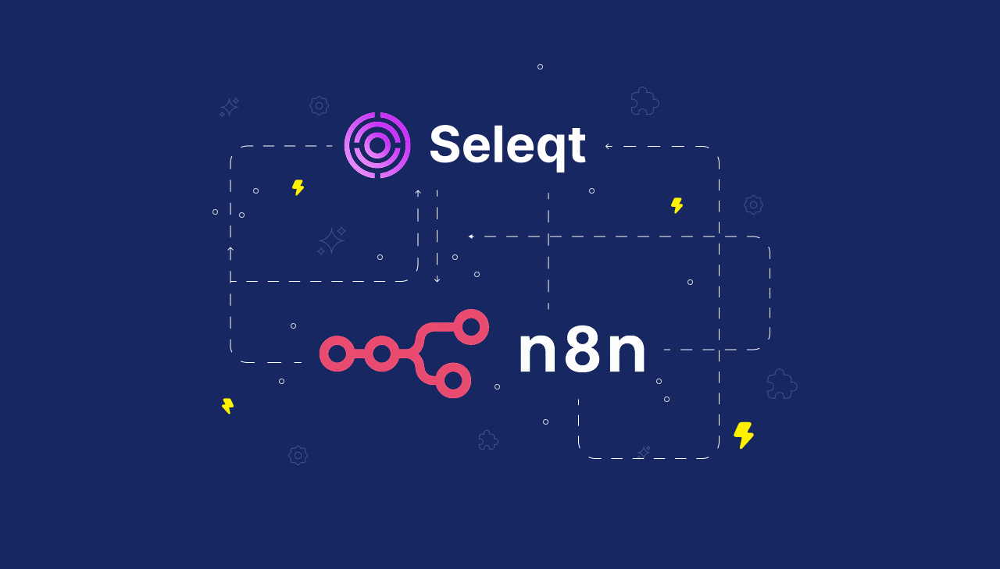
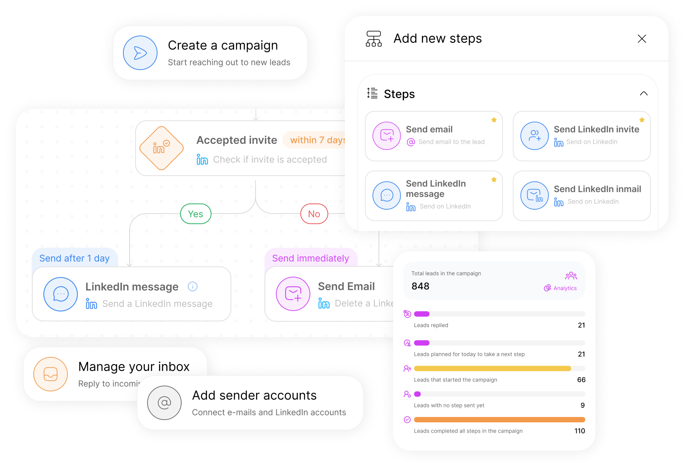
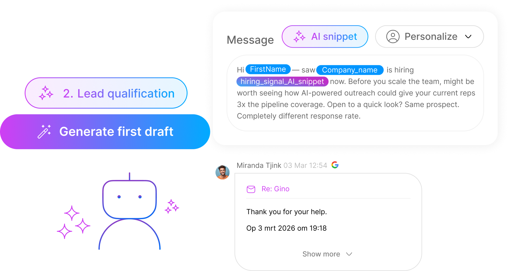
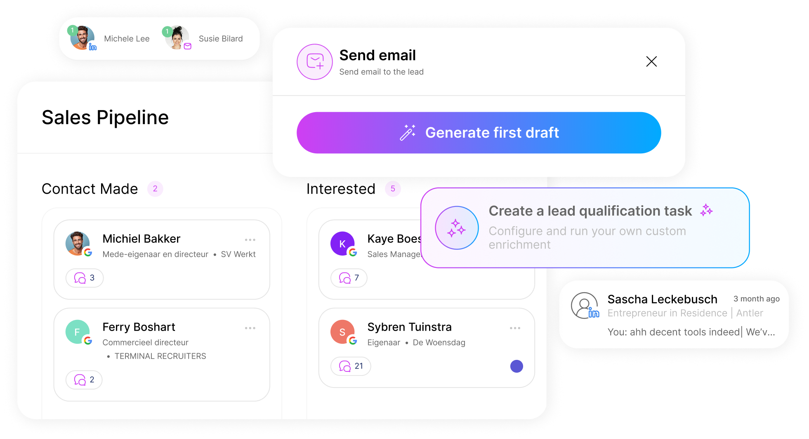

# n8n-nodes-seleqt

<p align="center">
  
</p>

Official [n8n](https://n8n.io) node for [Seleqt](https://seleqt.ai) — integrate Seleqt's AI-powered outbound engine directly into n8n to find your ideal buyers from 700M+ contacts, qualify them automatically, and send hyper-personalized messages across LinkedIn and email so you book more meetings without the manual grind.

---

## Features
<p align="center">
  
  
  
</p>

- **Campaigns** — create, update, and retrieve campaigns and their analytics
- **Lead Lists** — build lists, add leads, enrich profiles, and move leads into campaigns
- **Prospect Search** — search and filter prospects from the Seleqt database
- **Inbox** — send messages to prospects programmatically

---

## Installation

### n8n Cloud / Self-hosted UI

1. Go to **Settings → Community Nodes**
2. Click **Install**
3. Enter `n8n-nodes-seleqt` and confirm

The Seleqt node will appear in the node panel under **Transform**.

### Self-hosted Docker

```bash
docker exec -u node <your-n8n-container> npm install n8n-nodes-seleqt
docker restart <your-n8n-container>
```

---

## Credentials

1. Log in to [Seleqt](https://seleqt.ai) and go to **Settings → API Keys → New key**
2. In n8n, open any workflow and add the **Seleqt** node
3. Click **Credential → Create New**
4. Paste your API key and click **Test** to verify

> The Base URL defaults to `https://api.seleqt.ai/api/v1`. Only change this if you are on a self-hosted Seleqt instance.

---

## Supported Operations

### Campaign

| Operation | Description |
|-----------|-------------|
| Get Many | List all campaigns |
| Get | Retrieve a single campaign by ID |
| Create | Create a new campaign |
| Update | Update campaign details |
| Get Stats | Retrieve campaign analytics |
| Get Steps | Retrieve campaign steps |

### Lead List

| Operation | Description |
|-----------|-------------|
| Get Many | List all lead lists |
| Get Leads | Retrieve leads in a list |
| Create | Create a new lead list |
| Add Leads | Add leads to an existing list |
| Move to Campaign | Move leads from a list into a campaign |
| Enrich | Enrich lead profiles in a list |

### Prospect

| Operation | Description |
|-----------|-------------|
| Search | Search and filter prospects |

### Inbox

| Operation | Description |
|-----------|-------------|
| Send Message | Send a message to a prospect |

---

## API Reference

Full API documentation: [https://docs.seleqt.ai](https://docs.seleqt.ai)

---

## Development

```bash
npm install
npm run build       # compile TypeScript + copy assets
npm run dev         # watch mode
npm run lint        # run n8n-nodes-base linting rules
npm run lintfix     # auto-fix lint issues
```

To test locally inside a running n8n instance:

```bash
# In this repo
npm link

# In your n8n custom nodes directory (~/.n8n/custom)
npm link n8n-nodes-seleqt
```

Then restart n8n.

---

## License

[MIT](./LICENSE) © Seleqt
